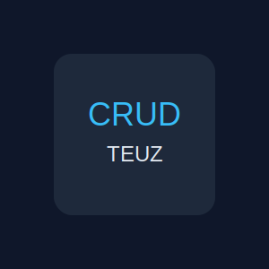

<p align="center">
  <a href="https://github.com/TeuzLins_" rel="noopener">
    
  </a>
</p>

<h3 align="center">crudteuz-monorepo</h3>

<div align="center">

[]()


</div>

---

<p align="center">
  Aplicacao full-stack em monorepo com autenticacao de usuarios, CRUD completo, rotas protegidas e persistencia de sessao.
  <br>
</p>

## Sumario

- [Sobre](#about)
- [Primeiros Passos](#getting_started)
- [Executando os Testes](#tests)
- [Uso](#usage)
- [Deploy](#deployment)
- [Tecnologias Utilizadas](#built_using)
- [Autores](#authors)
- [Agradecimentos](#acknowledgement)

## Sobre <a name="about"></a>

O **crudteuz-monorepo** e uma aplicacao full-stack desenvolvida com foco em autenticacao segura, gerenciamento de registros e organizacao de projeto em arquitetura de monorepo. O sistema permite cadastro e login de usuarios, controle de sessao, protecao de rotas e operacoes completas de **Create, Read, Update e Delete**.

O projeto foi construido com o objetivo de praticar conceitos essenciais de desenvolvimento web moderno, incluindo integracao entre frontend e backend, validacao de dados, persistencia em banco, autenticacao baseada em token e organizacao de codigo para facilitar manutencao e escalabilidade. Tambem serve como projeto de portfolio para demonstrar habilidades em desenvolvimento back-end e full-stack.

## Primeiros Passos <a name="getting_started"></a>

Estas instrucoes vao permitir que voce tenha uma copia do projeto rodando na sua maquina local para desenvolvimento e testes.

### Pre-requisitos

Antes de comecar, voce precisa ter instalado:

- **Node.js** 18 ou superior
- **npm**
- **Git**

Exemplo para verificar as versoes instaladas:

```bash
node -v
npm -v
git --version
```

### Instalacao

Clone o repositorio:

```bash
git clone https://github.com/TeuzLins_/crudteuz-monorepo.git
cd crudteuz-monorepo
```

Instale as dependencias do projeto:

```bash
npm install
```

Se preferir instalar separadamente por pacote:

```bash
npm run setup
```

Configure os arquivos de ambiente:

Backend:

```bash
cp server/.env.example server/.env
```

Frontend:

```bash
cp client/.env.example client/.env
```

Gere o client do Prisma e aplique as migrations, se necessario:

```bash
npm --prefix server run prisma:generate
npm --prefix server run prisma:migrate
```

Inicie o backend:

```bash
npm run dev:server
```

Em outro terminal, inicie o frontend:

```bash
npm run dev:client
```

Se quiser iniciar ambos com um unico comando:

```bash
npm run dev
```

### Exemplo de uso

1. Acesse a aplicacao no navegador.
2. Crie uma conta na tela de registro.
3. Faca login com suas credenciais.
4. Acesse o dashboard autenticado.
5. Realize operacoes de cadastro, listagem, edicao e exclusao de registros.

## Executando os Testes <a name="tests"></a>

Atualmente, os testes automatizados estao configurados no frontend.

Execute:

```bash
npm --prefix client run test -- --run
```

### O que os testes cobrem

Os testes validam fluxos importantes da interface:

- protecao de rota para o dashboard
- navegacao principal entre telas
- validacao da tela de registro administrativo
- operacoes de create, read, update e delete no dashboard

## Uso <a name="usage"></a>

A aplicacao foi projetada para oferecer um fluxo simples e seguro de autenticacao e gerenciamento de dados.

### Funcionalidades principais

- Cadastro de usuarios
- Login e logout
- Persistencia de sessao
- Rotas protegidas
- CRUD completo
- Feedback visual para acoes do usuario
- Interface moderna em tema dark

### Fluxo basico

1. O usuario se registra com nome, e-mail e senha.
2. O sistema autentica o acesso com token.
3. A sessao e mantida no navegador.
4. Apos o login, o usuario acessa areas protegidas.
5. No dashboard, pode criar, visualizar, editar e excluir registros conforme permissao.

## Deploy <a name="deployment"></a>

Para publicar o projeto em producao, recomenda-se:

### Frontend

- Vercel
- Netlify

### Backend

- Render
- Railway
- Fly.io

### Banco de dados

- SQLite para ambiente local
- PostgreSQL para producao

### Recomendacoes para producao

- utilizar variaveis de ambiente seguras
- configurar CORS corretamente
- proteger rotas com middleware de autenticacao
- armazenar senhas com hash
- utilizar um banco de dados mais robusto em producao
- configurar logs e monitoramento

## Tecnologias Utilizadas <a name="built_using"></a>

- **React** - Biblioteca para construcao da interface
- **Vite** - Ferramenta de build para o frontend
- **TypeScript** - Tipagem estatica no projeto
- **Node.js** - Ambiente de execucao do servidor
- **Express** - Framework do backend
- **Prisma** - ORM para acesso ao banco de dados
- **SQLite** - Banco de dados local
- **JWT** - Autenticacao baseada em token
- **Tailwind CSS** - Estilizacao da interface

## Autores <a name="authors"></a>

- [@TeuzLins_](https://github.com/TeuzLins_) - Desenvolvimento do projeto

## Agradecimentos <a name="acknowledgement"></a>

- Inspiracoes de projetos de autenticacao e CRUD para portfolio
- Comunidade open source pelas bibliotecas utilizadas
- Referencias de boas praticas em arquitetura web full-stack
